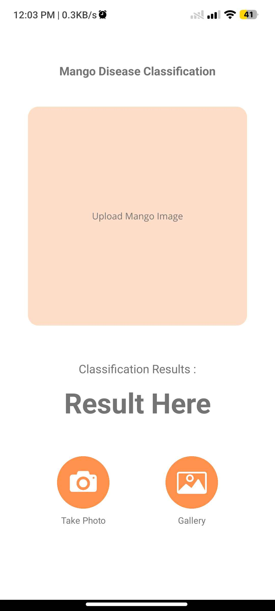
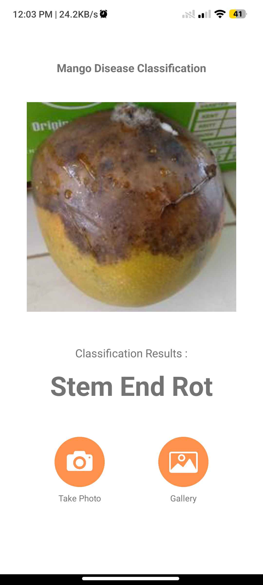

# Mango Disease Classification App

Machine learning-based Android application to detect and classify diseases in mango fruit using the Convolutional Neural Network (CNN) model. I use this project for my Thesis to obtain a Bachelor's degree.

## Screenshots
<p align="center">
  
  
</p>


## Project Stucture
```bash
├── android app/ # Android Studio Projects
│ ├── app/
│ ├── gradle/
│ └── ...
├── machine learning model/ # Jupyter Notebook (Model training)
│ ├── MangoDDSClassification_1.ipynb
│ ├── MangoDDSClassification_2.ipynb
│ ├── MangoDDSClassification_3.ipynb
│ └── ...
├── Mango Disease Classification.apk # APK ready to install
└──  MangoFruitDDS.tflite # CNN model in .tflite format
```
## Dataset
The dataset used is a dataset from Kaggle with the following link:
https://www.kaggle.com/datasets/warcoder/mangofruitdds

The dataset containing 1700 images of 224*224 in JPG format. The dataset contains images of four diseases namely Alternaria, Anthracnose, Black Mould Rot and Stem and Rot. An additional category in the dataset is healthy fruits. Fruit images are captured from an orchard located in Senegal, using a mobile phone camera.
## Machine Learning Model

The CNN model was trained using a mango image dataset with 5 categories:
- Alternaria
- Anthracnose
- Black Mold Rot
- Healthy
- Stem End Rot

The model training notebook is located in the `machine learning model/` folder. And the best model is the `MangoDDSClassification_2.ipynb` model. After training, the model is exported to `.tflite` format for use in the Android application.
## Usage (Machine Learning Model)

1. Clone the repository
```bash
git clone https://github.com/ardrkha/MangoDiseasesClassificationApp.git
cd MangoDiseasesClassificationApp
```
2. Create Environment
```bash
python -m venv env
source env/bin/activate  # Linux/macOS
env\Scripts\activate     # Windows
```
3. Install dependencies:
```bash
pip install -r requirements.txt
```
4. Open and run the notebook:
- Use Jupyter Notebook or JupyterLab to open the `.ipynb file`.
- Run all cells to train the model and export a `.tflite file`.
## Android App

The application was developed using Android Studio. The `android app/` folder contains the entire source code of the application, including configuration files and the implementation of the TFLite model integration into the application.

The ready-to-use APK is available in the file:
- `Mango Disease Classification.apk`
## Usage (Android App)

1. Open the android app/ folder in Android Studio.

2. Make sure the MangoFruitDDS.tflite file is placed in the assets/ folder in the project.

3. Build and run the app on an emulator or physical device.
## Dependencies

All dependencies are listed in environment.yml. Ensure you install them using Conda.
## Build APK

The final APK can be found at:
- `Mango Disease Classification.apk`
## License

This project was created for final assignment/thesis purposes and is only used for educational purposes.


## Contact

If you have any questions, feel free to reach out to us at hardatama27@gmail.com.

Developed by Hardatama Rakha Ugraha - 2025
